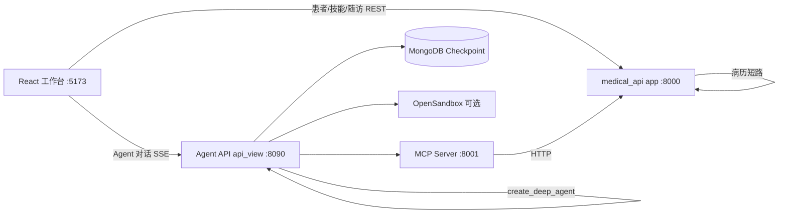

# DocClaw DeepAgents Harness 实施 Plan

> **用途**：DoctorClaw DeepAgents Harness 实施说明。  
> **方法论**：`create_deep_agent` + LangGraph + MCP + CompositeBackend + Middleware + HITL。  
> **原则**：现有 `backend/app/`（医疗业务 API + Skill Runtime）保留为**业务域**；Harness 作为**智能体运行时**叠加上去。  
> **最后更新**：2026-06-07  
> **关联文档**：[`PROJECT_CONTEXT.md`](./PROJECT_CONTEXT.md)、[`README.md`](./README.md)

---

## 目录

1. [目标架构](#1-目标架构)
2. [目录结构](#2-目录结构)
3. [Harness 组件映射](#3-harness-组件映射)
4. [分阶段实施 Plan](#4-分阶段实施-plan)
5. [MCP 工具清单](#5-mcp-工具清单)
6. [子 Agent 配置](#6-子-agent-配置)
7. [双轨执行设计](#7-双轨执行设计)
8. [前端改动](#8-前端改动)
9. [依赖与环境变量](#9-依赖与环境变量)
10. [时间线](#10-时间线)
11. [关键决策记录](#11-关键决策记录)
12. [风险与缓解](#12-风险与缓解)
13. [验收标准](#13-验收标准)

---

## 1. 目标架构

### 1.1 终态拓扑（三进程 + 前端）



| 服务 | 端口 | 职责 |
|------|------|------|
| `backend/app` | **8000** | 医疗业务 REST、Skill Runtime 短路、SQLite |
| `backend/mcp_server` | **8001** | FastMCP，将 `app` API 工具化 |
| `backend/agent` + `api_view` | **8090** | DeepAgents Harness、SSE、`/resume` |
| `frontend` | **5173** | 医生工作台 + Agent 对话 + HITL |
| MongoDB | **27017** | LangGraph Checkpointer（HITL 续跑必需） |

### 1.2 架构层级对应

| 层级 | 标准 Harness | DocClaw 医疗版 |
|------|--------|----------------|
| 业务域 | Java 采购 ERP :8080 | `app` FastAPI :8000 |
| MCP | 采购工具 → Java API | 医疗工具 → `app` API |
| Harness | `create_deep_agent` 11 阶段流水线 | 同结构，域改为医疗 |
| 子 Agent | analyst + order | clinical-assistant + followup-executor |
| 前端 | Vue 聊天 :3000 | React 工作台 :5173 |

---

## 2. 目录结构

仓库内新建/扩展：

```
├── HARNESS_PLAN.md                   # 本文档
├── PROJECT_CONTEXT.md
├── README.md
├── backend\
│   ├── app/                          # 【保留】医疗业务域
│   ├── agent/                        # 【新建】DeepAgents Harness 核心
│   │   ├── main_agent.py             # 11 阶段 create_deep_agent 流水线
│   │   ├── config.py                 # 模型、MongoDB、Sandbox、路径
│   │   ├── env_utils.py
│   │   ├── schema.py                 # DoctorContext
│   │   ├── middleware_config.py
│   │   ├── memory/
│   │   │   ├── AGENTS.md             # 医生助理准则
│   │   │   └── prompts.py
│   │   ├── subagents/
│   │   │   ├── loader.py
│   │   │   └── configs/
│   │   │       ├── clinical_assistant.yaml
│   │   │       └── followup_executor.yaml
│   │   ├── middlewares/
│   │   │   ├── context_injection.py
│   │   │   ├── skills_sync.py
│   │   │   ├── user_skills_restore.py
│   │   │   ├── memory_update.py
│   │   │   └── tools_summarization.py
│   │   ├── backends/
│   │   │   ├── sandbox_setup.py
│   │   │   └── custom_opensandbox.py
│   │   └── tools/
│   │       ├── mcp_client.py
│   │       ├── hitl_tools.py
│   │       ├── assign_skill.py
│   │       ├── download_sandbox_file.py
│   │       └── web_search.py
│   ├── mcp_server/                   # 【新建】医疗 MCP
│   │   ├── server_main.py
│   │   ├── server_config.py
│   │   ├── http_base.py
│   │   └── tools/
│   │       ├── patient_tools.py
│   │       ├── consult_tools.py
│   │       ├── followup_tools.py
│   │       ├── skill_tools.py
│   │       ├── notification_tools.py
│   │       └── his_tools.py
│   ├── api_view/                     # 【新建】Agent 对话 API
│   │   ├── web_main.py
│   │   ├── web_config.py
│   │   ├── agent_loader.py
│   │   └── api/
│   │       ├── chat.py
│   │       └── history.py
│   ├── skills/
│   │   ├── main/skill-management/
│   │   ├── clinical/
│   │   ├── followup/
│   │   └── clawhub/                  # 【保留】
│   ├── requirements.txt                # app 轻量依赖
│   ├── requirements-agent.txt        # Harness 专用依赖
│   ├── start_agent.py
│   └── start.bat                       # 【改】多进程启动
└── frontend/                         # 【改】Agent SSE + HITL
```

---

## 3. Harness 组件映射

| Harness 组件 | DocClaw 医疗版 | 说明 |
|-------------|----------------|------|
| `ProcurementContext` | `DoctorContext` | `doctor_id, doctor_name, department, patient_slug?` |
| Java ERP :8080 | `app` FastAPI :8000 | 业务数据源 |
| `procurement-analyst` | `clinical-assistant` | 临床分析、文献、检查解读 |
| `procurement-order` | `followup-executor` | 随访计划创建与执行 |
| `supplier_*` MCP | `patient_*` MCP | 患者队列 |
| `order_*` MCP | `followup_*` MCP | 随访写操作 + HITL |
| `request_order_info` | `request_record_confirm` / `request_followup_confirm` | HITL |
| `/skills/procurement/` | `/skills/clinical/` + `/skills/followup/` | 沙箱 Skill 手册 |
| `AGENTS.md` 采购准则 | `AGENTS.md` 医生助理准则 | 主 Agent 记忆 |
| MongoDB Checkpointer | 同 | HITL interrupt/resume |
| Vue Chat :3000 | React ConsultPage | 工作台内嵌 Agent |

---

## 4. 分阶段实施 Plan

### Phase 0：基础设施（3–4 天）

**目标**：Harness 能 `create_deep_agent()` 启动，尚无业务工具。

| 任务 | 产出 | 验收 |
|------|------|------|
| 新建 `requirements-agent.txt` | deepagents、langgraph、fastmcp、langgraph-checkpoint-mongodb 等 | `pip install` 成功 |
| 新建 `agent/config.py` | MAIN_MODEL、SUMMARY_MODEL、CHECKPOINTER、STORE | 能连 MongoDB |
| 新建 `agent/schema.py` | `DoctorContext` dataclass | invoke 时可注入 |
| 新建 `agent/main_agent.py` 骨架 | 11 阶段流水线 | 日志打印 Phase 1–9 |
| 新建 `api_view/web_main.py` + `agent_loader.py` | :8090 健康检查 | `GET /` 返回 ok |
| 新建 `start_agent.py` | 启动 MCP + Agent API | 两进程可起 |
| `.env.example` 补充 | Harness 相关变量 | 文档齐全 |

**不做**：MCP 工具、子 Agent YAML、前端改动。

---

### Phase 1：MCP 医疗工具层（4–5 天）

**目标**：Agent 能通过 MCP 读写 DocClaw 业务 API。

| 任务 | 验收 |
|------|------|
| 实现 6 个 MCP tools 文件 | `patient_summary` 可调用 |
| 注册到 `server_main.py` | MCP :8001 正常 |
| `agent/tools/mcp_client.py` 加载工具 | Agent 工具池 > 15 个 |
| `app` 补充缺失端点（如需要） | `POST /api/notifications`、`POST /api/medical-records/{slug}/confirm` |

详见 [第 5 节 MCP 工具清单](#5-mcp-工具清单)。

---

### Phase 2：子 Agent + Harness 完整装配（5–6 天）

**目标**：`create_deep_agent` 带 2 个子 Agent 完整运行。

| 任务 | 验收 |
|------|------|
| `clinical_assistant.yaml` + `followup_executor.yaml` | 2 个子 Agent 工具解析成功 |
| `memory/AGENTS.md` 医生版 | 委派规则明确 |
| `hitl_tools.py` 病历/随访确认 | interrupt 可触发 |
| 主 Agent 中间件栈 | 与 DeepAgents 标准实践对齐 |
| `POST /api/agent/chat` SSE | 流式 token |
| `POST /api/agent/resume` | HITL 续跑 |

详见 [第 6 节子 Agent 配置](#6-子-agent-配置)。

**主 Agent 中间件栈**：

```python
main_middleware = [
    ContextInjectionMiddleware(),
    SkillsSyncMiddleware(sandbox_backend),
    UserSkillsRestoreMiddleware(sandbox_backend, SKILLS_STORE_NAMESPACE),
    build_summarization_middleware(backend, SUMMARY_MODEL),
    MemoryUpdateMiddleware(model=SUMMARY_MODEL),
    ModelCallLimitMiddleware(run_limit=50),
    ToolCallLimitMiddleware(run_limit=200),
]
```

**`create_deep_agent` 11 阶段流水线**（对标 DeepAgents `main_agent.py`）：

1. 沙箱配置
2. AGENTS.md 写入沙箱
3. CompositeBackend 分流（`/memories/`、`/persisted-skills/`）
4. MCP 工具加载
5. 可视化/通用工具合并
6. 工具池构建
7. 子 Agent YAML 加载
8. 子 Agent 中间件
9. 子 Agent 工具名称解析
10. 主 Agent 中间件栈
11. `create_deep_agent()`

---

### Phase 3：前端 + 问诊双轨集成（4–5 天）

**目标**：医生在工作台内无缝切换 Skill 模式 / Agent 模式。

| 文件 | 改动 |
|------|------|
| `frontend/src/api.ts` | `agentChatStream()`、`agentResume()` |
| `frontend/src/pages/ConsultPage.tsx` | 模式切换；Agent 接 :8090 |
| `frontend/src/components/InterruptBanner.tsx` | 【新建】HITL 确认 |
| `frontend/vite.config.ts` | 代理 `/agent-api` → :8090 |

详见 [第 8 节前端改动](#8-前端改动)。

---

### Phase 4：Sandbox Skills + 记忆 + 治理（3–4 天）

| 任务 | 内容 |
|------|------|
| `skills/clinical/medical-record-analysis/SKILL.md` | 从 `medical_record/prompts.py` 提炼 |
| `skills/followup/plan-create/SKILL.md` | 随访创建 SOP |
| `skills_sync` 中间件 | 同步技能到沙箱 |
| `/memories/{doctor_id}/preferences.md` | 医生偏好记忆 |
| `audit_service` 扩展 | 记录 Agent 工具调用链 |

---

### Phase 5：闭环与演示（2–3 天）

端到端演示脚本见 [第 13 节验收标准](#13-验收标准)。

---

### Phase 6（后续，不挡 MVP）

- RAG 知识库（`backend/app/knowledge/`）
- 风险预警（`Patient.risk_level`）
- 真实 HIS MCP（替换 `his_*` Mock）
- 国产算力 / 本地模型路由
- 语音 ASR

---

## 5. MCP 工具清单

命名规范：`{分组}_{动作}`，与 MCP 工具规范一致。

### patient_*

| 工具名 | HTTP | 说明 |
|--------|------|------|
| `patient_list` | `GET /api/patients` | 队列列表 |
| `patient_summary` | `GET /api/patients/summary` | 待接诊/问诊中/已完成统计 |
| `patient_get` | `GET /api/patients/{slug}` | 患者详情 |
| `patient_start_consult` | `POST /api/patients/{slug}/start` | 开始问诊 |
| `patient_complete_consult` | `POST /api/patients/{slug}/complete` | 结束问诊 |

### consult_*

| 工具名 | HTTP | 说明 |
|--------|------|------|
| `consult_get_messages` | `GET /api/consult/{slug}/messages` | 问诊对话历史 |
| `consult_send_message` | `POST /api/consult/{slug}/messages` | Agent 内部写回 |

### followup_*

| 工具名 | HTTP | 说明 |
|--------|------|------|
| `followup_list_plans` | `GET /api/followup` | 随访计划列表 |
| `followup_create_plan` | `POST /api/followup` | 仅 HITL 通过后 |
| `followup_pending_tasks` | `GET /api/followup/tasks/pending` | 待执行任务 |
| `followup_execute_task` | `POST /api/followup/tasks/{id}/execute` | 执行任务 |

### skill_*

| 工具名 | HTTP | 说明 |
|--------|------|------|
| `skill_list` | `GET /api/skills` | 已启用技能 |
| `skill_get` | `GET /api/skills/{id}` | 技能详情 |

### notification_*

| 工具名 | HTTP | 说明 |
|--------|------|------|
| `notification_list` | `GET /api/notifications` | 通知列表 |
| `notification_create` | `POST /api/notifications` | 创建提醒 |

### his_*（MVP Mock）

| 工具名 | MVP 实现 |
|--------|----------|
| `his_get_labs` | 返回 `patient.completed_exams` |
| `his_get_history` | 返回 `patient.key_notes` |
| `his_write_record` | HITL 后写入 ConsultMessage + 审计 |

---

## 6. 子 Agent 配置

### clinical_assistant.yaml

```yaml
name: clinical-assistant
description: >
  临床辅助专家。负责问诊分析、检查结果解读、医学文献检索、
  病历草稿辅助（非最终写入）。关键词：分析、检查、诊断、文献、PubMed。
tools:
  - patient_get
  - consult_get_messages
  - his_get_labs
  - his_get_history
  - skill_list
  - web_search
skills:
  - /skills/clinical/
```

### followup_executor.yaml

```yaml
name: followup-executor
description: >
  随访执行专家。负责创建随访计划、查询待办、执行随访任务、
  生成患者触达提醒。关键词：随访、复查、提醒、触达、复诊。
tools:
  - patient_get
  - followup_list_plans
  - followup_create_plan
  - followup_pending_tasks
  - followup_execute_task
  - notification_create
  - request_followup_confirm
skills:
  - /skills/followup/
interrupt_on:
  - followup_create_plan
```

### AGENTS.md 核心委派规则

- 病历最终写入 → `clinical-assistant` 生成草稿 → **必须** `request_record_confirm`
- 随访计划创建 → `followup-executor` → **必须** `request_followup_confirm`
- 简单队列查询 → 主 Agent 直接 `patient_*`
- 诊中实时病历结构化 → **提示使用 Skill 模式「智能病历助手」**（走短路，不进沙箱）

### HITL 工具

| 工具 | interrupt type | 恢复后动作 |
|------|----------------|------------|
| `request_record_confirm` | `medical_record_confirm` | `his_write_record` |
| `request_followup_confirm` | `followup_plan_confirm` | `followup_create_plan` |

---

## 7. 双轨执行设计

问诊请求不全部进 Harness，保留 DocClaw 已有 Skill Runtime 优势。

| 通路 | 触发条件 | 执行路径 | 理由 |
|------|----------|----------|------|
| **A. Skill Runtime 短路** | Skill = 智能病历助手 + 病历意图 | `skill_runtime_stream` → `medical_record` Schema | 质量稳、延迟低 |
| **B. DeepAgents Harness** | 复杂分析、随访、多步任务、Agent 模式 | 主 Agent → 子 Agent → MCP | 编排、工具、HITL |

**API 入口**：

```
POST /api/consult/{slug}/messages/stream?mode=skill   → 通路 A（默认）
POST /api/agent/chat                                  → 通路 B
POST /api/agent/resume                                → HITL 续跑
```

---

## 8. 前端改动

### SSE 事件协议（与 DeepAgents 标准实践对齐）

| event | 含义 |
|-------|------|
| `token` | 模型流式文本 |
| `tool_call` | 工具调用中 |
| `tool_result` | 工具返回 |
| `interrupt` | HITL 中断 |
| `subagent` | 子 Agent 委派 |
| `done` | 本轮结束 |

### vite 代理

```ts
proxy: {
  '/api': { target: 'http://127.0.0.1:8000' },
  '/agent-api': { target: 'http://127.0.0.1:8090', rewrite: (p) => p.replace(/^\/agent-api/, '/api') },
}
```

### ConsultPage 双模式

- 默认：**Skill 模式**（现有 `sendMessageStream`）
- 切换 **Agent 模式**：`agentChatStream(slug, message)`，thread_id 与 patient_slug 绑定

---

## 9. 依赖与环境变量

### requirements-agent.txt（核心）

```
deepagents>=0.4.12
langgraph>=1.1.3
langgraph-checkpoint-mongodb>=4.0.1
langchain>=1.2.13
langchain-openai>=1.1.12
langchain-mcp-adapters>=0.2.2
fastmcp>=3.2.4
pymongo>=4.0
opensandbox>=0.1.7          # 可选
python-dotenv
pyyaml
httpx
uvicorn
```

> **注意**：deepagents 要求 **Python 3.11+**，建议独立 venv。

### .env 增补

```env
# Skill Runtime（已有）
LLM_API_KEY=
LLM_BASE_URL=
LLM_MODEL=

# Harness 专用
AGENT_API_KEY=
AGENT_BASE_URL=https://api.deepinfra.com/v1/openai
AGENT_MODEL=google/gemma-4-26B-A4B-it
WEB_SEARCH_API_KEY=
MONGODB_URI=mongodb://localhost:27017
MONGODB_DB=doctorclaw_agent

MEDICAL_API_BASE_URL=http://localhost:8000/api
MCP_HOST=127.0.0.1
MCP_PORT=8001
AGENT_API_PORT=8090

SANDBOX_DOMAIN=               # 可选
```

### 启动命令（目标形态）

```bash
# 终端 1：医疗业务 API
cd backend
uvicorn app.main:app --reload --port 8000

# 终端 2–3：或一键
cd backend
python start_agent.py         # MCP :8001 + Agent API :8090

# 终端 4：前端
cd frontend
npm run dev
```

---

## 10. 时间线

| 阶段 | 工期 | 累计 | 里程碑 |
|------|------|------|--------|
| Phase 0 基础设施 | 3–4 天 | D4 | Agent 空跑 + MongoDB |
| Phase 1 MCP 工具 | 4–5 天 | D9 | MCP 调通业务 API |
| Phase 2 Harness 装配 | 5–6 天 | D15 | 子 Agent + SSE + HITL |
| Phase 3 前端集成 | 4–5 天 | D20 | 工作台双轨可用 |
| Phase 4 治理完善 | 3–4 天 | D24 | Skills 同步 + 审计 |
| Phase 5 演示验收 | 2–3 天 | **D27** | 6 步演示全通 |

**2 周极紧版**：Phase 0–2 必须；Phase 3 可先做独立 Agent 页；Phase 4 后置。

---

## 11. 关键决策记录

| 决策 | 选择 | 理由 |
|------|------|------|
| 架构方法论 | **DeepAgents Harness** | 对齐「智能体调度中枢」 |
| 病历结构化 | **Skill Runtime 短路** | Schema 强约束；Harness 负责多步 |
| MCP | **独立进程 :8001** | 医疗工具层；后期可换 HIS |
| Checkpointer | **MongoDB** | HITL interrupt/resume 必需 |
| Sandbox | **Phase 4 前可降级** | 无 OpenSandbox 时用本地 backend |
| 业务库 | **SQLite 不动** | Agent 状态在 MongoDB |
| 代码来源 | **本仓库实现** | 医疗域定制开发 |

---

## 12. 风险与缓解

| 风险 | 缓解 |
|------|------|
| Python 版本 | 独立 venv，`py -3.11` |
| MongoDB 未安装 | Docker `mongo:7` |
| 双 LLM 配置复杂 | `.env.example` + `start_agent.py` |
| 双轨 UX 混乱 | 默认 Skill 模式；Agent 显式切换 |
| 病历质量 | 诊中结构化强制 Skill 短路 |
| 工期不足 | 砍 Sandbox 同步、web_search；Agent 先独立页 |

---

## 13. 验收标准

### 端到端演示（6 步）

1. 「今天多少待接诊？」→ 主 Agent → `patient_summary`
2. 「张三的主诉和检查结果？」→ `clinical-assistant` → `patient_get` + `his_get_labs`
3. Skill 模式 → 「整理门诊病历」→ 短路 → 结构化 JSON + field_diffs
4. Agent 模式 → 「给张三创建 2 周后复查随访」→ HITL → 确认 → 计划落库
5. scheduler 触发 → 随访任务执行 → 通知产生
6. 「有哪些待执行随访？」→ `followup_pending_tasks`

### Phase 5 后能力对照

| 文档要求 | 状态 |
|----------|------|
| Skill 框架 | ✅ |
| MCP | ✅ |
| 智能体调度中枢 | ✅ |
| 患者管理为核心 | ✅ |
| 实时 + 计划性任务 | ✅ |
| HITL | ✅ |
| RAG | ⏳ Phase 6 |
| 国产算力一体机 | ⏳ Phase 6 |
| 语音 ASR | ⏳ Phase 6 |

---

