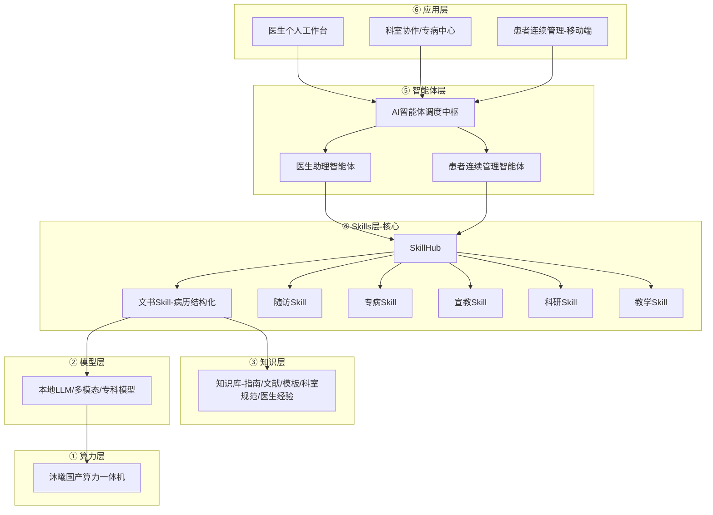

# DoctorClaw / DocClaw 项目全景上下文文档

> **用途**：DoctorClaw 项目全景说明，涵盖产品定位、架构设计、实现状态与演进规划。  
> **最后更新**：2026-06-07（HARNESS Phase 0–5 落地后修订）  
> **实施计划详表**：见 [`HARNESS_PLAN.md`](./HARNESS_PLAN.md)；演示验收见 [`DEMO.md`](./DEMO.md)  
> **参考蓝图位置**：`项目目标/图1.png`、`项目目标/图2.png`、`项目目标/图3.png`

---

## 目录

1. [项目起源与目标](#1-项目起源与目标)
2. [行业参考能力分析](#2-行业参考能力分析)
3. [三张目标蓝图深度解读](#3-三张目标蓝图深度解读)
4. [当前 DocClaw 代码实现状态](#4-当前-docclaw-代码实现状态)
5. [目标架构 vs 现状：能力缺口](#5-目标架构-vs-现状能力缺口)
6. [Skill 执行与智能体：LangGraph 是否必需](#6-skill-执行与智能体langgraph-是否必需)
7. [文书 Skill（病历结构化）算力与模型配置](#7-文书-skill病历结构化算力与模型配置)
8. [目标架构关系图](#8-目标架构关系图)
9. [大工程分阶段 Plan 建议](#9-大工程分阶段-plan-建议)
10. [代码结构与 API 清单](#10-代码结构与-api-清单)
11. [数据模型摘要](#11-数据模型摘要)
12. [启动与开发说明](#12-启动与开发说明)

---

## 1. 项目起源与目标

### 1.1 初始需求

产品对标主流 **医疗 AI 工作台** 能力（患者队列、问诊、技能管理、随访）。

核心定位：

- **Skills 管理平台**：医生可以使用已有 Skill，或发布 Skills
- **辅助医生工作**，包括两类任务：
  - **实时性任务**：如医生看诊时门诊病历结构化
  - **计划性任务**：如创建随访计划、执行随访任务

### 1.2 品牌演进

| 阶段 | 名称 | 说明 |
|------|------|------|
| MVP 代码仓库 | **DocClaw** | 当前代码目录名 |
| 目标产品（蓝图） | **DoctorClaw 医疗智能体平台** | 图1–3 正式命名 |
| 合作方 | 中软（CS&S）、可宁、**沐曦（METAX）** | 国产算力一体机 |

### 1.3 终局定义（来自三张蓝图）

> **DoctorClaw** = 基于沐曦国产算力一体机的医疗智能体平台，以 **Skills 为核心引擎**，以 **医生主导的患者连续管理** 为主线，提供医生个人工作台与科室 SkillsHub。

**关键转变**：终局不是「问诊时的 Skills 工具箱」，而是 **「医生智能体 + 患者全生命周期管理 + 科室能力平台」**。

---

## 2. 行业参考能力分析

### 2.1 技术栈（通过页面源码确认）

- React + Vite SPA
- Material Symbols 图标
- 路由为前端 React Router

### 2.2 页面与路由

| 路由 | 页面 | 功能 |
|------|------|------|
| `/queue` | 患者队列 | 今日问诊，待接诊/问诊中/已完成筛选，初诊/复诊筛选，搜索 |
| `/skills` | 个人技能 | 管理本地 AI 技能，启用/停用/发布/删除 |
| `/skills/new` | 创建技能 | 名称、简介、输入/输出说明、System Prompt |
| `/store` | 技能广场 | 今日推荐、分类、获取技能、主编精选 |
| `/store/:id` | 技能详情 | 适用场景、兼容能力、推荐理由 |
| `/consult/:slug` | 问诊工作台 | 如 `/consult/patient-zhang-san` |
| `/notifications` | 通知 | |
| `/settings` | 设置 | |
| `/help` | 帮助 | |

### 2.3 患者队列页 UI 要点

- 侧栏：医疗 AI 工作台、李医生、患者队列/个人技能/技能广场
- 底部：智能助理「已链接」状态
- 统计：待接诊 9 | 问诊中 1 | 已完成 10
- 筛选：全部状态、待接诊、问诊中、已完成；全部类型、初诊、复诊
- 患者卡片：序号、姓名、性别年龄、标签（初诊/复诊、急需评估/普通门诊/慢病复诊）、主诉
- 操作：查看初诊资料/既往病历、开始问诊

### 2.4 个人技能页 UI 要点

- 统计卡片：已启用技能、草稿中、已发布、默认技能
- 技能卡片示例：
  - **智能病历助手**（默认技能、固定启用）— 病历助手模式
  - **检查结果标红助手**（已启用，可 toggle）
  - **技能封装助手**（已发布）
- 操作：查看配置/编辑、发布到广场、删除技能

### 2.5 技能广场页 UI 要点

- Hero 推荐卡：如今日推荐「张医生的高频问诊单」
- 分类：全部、临床诊断、文献科研、病历协作、患者教育
- 技能列表 + 主编精选
- 新建技能入口

### 2.6 问诊工作台 UI 要点

- 顶栏：返回队列、患者名+标签、结束问诊
- **模式切换**：Skill 模式 / Agent 模式（Harness :8090）
- 左侧聊天：系统欢迎、AI 问诊分析摘要、医生/助手对话；Agent 模式含工具调用提示与 HITL 确认横幅
- Skill 模式下技能切换 chips
- 输入：上传附件、文本输入、录音、发送
- 右侧接诊摘要：患者情况、已完成检查、重点提示、初诊说明

### 2.7 创建技能表单字段

- 技能名称
- 技能简介
- 输入说明
- 输出说明
- System Prompt / 调用约束
- 按钮：保存、保存并发布

---

## 3. 三张目标蓝图深度解读

> 蓝图文件：`项目目标/图1.png`、`图2.png`、`图3.png`

### 3.1 图1 — 产品愿景 / 首页

**标题**：DoctorClaw 医疗智能体平台  
**副标题**：基于沐曦国产算力一体机的医生智能体与科室级 SkillsHub  
**Slogan**：帮助医生持续管理自己的患者

**合作 Logo**：中软 CS&S、可宁、沐曦 METAX

**四大价值支柱**：

| 支柱 | 描述 |
|------|------|
| 医生智能体 | 懂医学、更懂医生的专属智能助理 |
| 患者连续管理 | 全周期随访，提升诊疗连续性 |
| 科室 SkillsHub | 科室能力沉淀，协同共创 |
| 国产算力一体机 | 沐曦，安全、高效、稳定 |

**UI 模块（比当前 DocClaw 更「患者中心」）**：

侧栏导航：
- 患者管理
- 随访计划
- 智能助手
- 洞察分析
- 知识库
- 系统管理

仪表盘指标：
- 患者总数：1,256
- 随访中：892
- 待随访：128
- **高风险预警：36**

患者列表字段：姓名、性别、年龄、诊断（高血压/冠心病等）、随访状态（绿/黄/红）、下次随访时间

浮层组件：
- 智能随访计划（日历）
- 患者洞察（趋势曲线）
- 风险预警（36 位高风险患者需关注）

**硬件**：前景展示沐曦 METAX 银色一体机 → 强调 **本地化/on-premise** 部署，非纯云端 SaaS。

**与当前 DocClaw 差距**：

| 图1 能力 | 当前 DocClaw |
|----------|--------------|
| 患者连续管理 / 风险分层 | 仅有简单随访计划 |
| 洞察分析 / 趋势 | ❌ 未实现 |
| 知识库 | ❌ 未实现 |
| 沐曦本地化一体机 | ❌ 未实现 |
| 以「患者池」为中心 | 以「今日队列」为中心 |

---

### 3.2 图2 — 平台六层架构

**标题**：DoctorClaw 平台架构  
**副标题**：自底向上，以 Skills 为核心，驱动多场景医疗 AI 应用

#### 六层架构（自下而上）

| 层级 | 名称 | 内容 | 工程含义 |
|------|------|------|----------|
| ① | 算力层 | 沐曦国产算力一体机；本地化、私有化、数据安全、稳定推理 | 部署形态决定，非普通云 SaaS |
| ② | 模型层 | 本地大模型、多模态、专科模型 | 模型路由、量化、并发调度 |
| ③ | 知识层 | 指南、文献、病历模板、科室规范、医生经验 | RAG + 模板库 + 个人/科室知识 |
| ④ | **Skills 层（核心）** | 专病、随访、复查、宣教、**文书**、科研、教学；可复用、可组合、可持续演进 | 当前 Skill CRUD 只是「目录」 |
| ⑤ | 智能体层 | 医生助理、患者连续管理、文书/知识/科研智能体 | 需要 **调度中枢** |
| ⑥ | 应用层 | 医生个人工作台、科室协作、专病中心、患者连续管理 | PC + 移动端 |

#### 中枢：AI 智能体调度中枢

各模块均连接 **「AI 智能体调度中枢」**：

| 模块 | 功能 |
|------|------|
| 医生个人工作台 | 患者总览、待办、随访提醒、知识推荐、数据看板 |
| SkillHub | 专病 / 随访 / 宣教 / 文书 / 科研 / 教学 |
| 知识库 | 指南、文献、模板、专家经验 |
| 科室协作 / 专病中心 | 病历讨论、MDT、质控、数据共享 |
| 患者连续管理（移动端） | 随访计划、健康宣教、用药提醒、症状记录、在线复诊沟通 |
| 沐曦国产算力一体机 | 底层硬件 |

**底部 Slogan**：

> DoctorClaw 以国产算力为底座，以 Skills 为核心，以医生主导的患者管理为主线。

#### Skills 层 vs 智能体层

- **Skills 层**：可调用能力单元（「文书」= 病历结构化 Skill）
- **智能体层 + 调度中枢**：决定调用哪些 Skill、顺序、是否追问、是否查知识库/HIS

---

### 3.3 图3 — 四档产品矩阵

**标题**：DoctorClaw 产品矩阵  
**副标题**：从医生个人智能体，到科室级 SkillsHub，再到医院级智能体平台

#### 四档对照

| 版本 | 算力形态 | 使用场景 | 核心能力 | 价值主张 |
|------|----------|----------|----------|----------|
| **医生个人版** | **单卡 AI 一体机** | 个人医生、专家门诊、主任办公室 | 个人知识库、**病历文书**、咨询摘要、个人患者池 | 让每一位医生都有自己的智能体工作台 |
| **科室版** | **八卡 AI 一体机** | 医院科室、专病中心、MDT 中心 | **科室 SkillsHub**、专病 Skill、多医生共享调用 | 让一个科室拥有自己的医疗智能体能力中心 |
| **医院级扩展版** | 八卡以上 / 多机扩展 | 多科室协同、全院智能体平台 | 多科室 SkillsHub、统一知识库、**智能体调度** | 支撑医院级医疗智能体平台建设 |
| **区域中心级** | 区域算力中心 / 集群部署 | 医共体、区域医疗中心、城市医疗 AI 节点 | 能力下沉、基层医生辅助、区域协同服务 | 让智能体能力从医院延伸到区域医疗网络 |

#### 底部四原则

1. **统一平台架构** — 覆盖个人、科室、医院、区域
2. **本地化部署**
3. **数据安全可控**
4. **国产算力支撑、按需扩展**

#### 对「病历结构化 Skill」的含义

- 图3 将「病历文书」列为 **医生个人版（单卡）** 标配能力
- **最小商业配置** = 单卡 + 32B 级 + Skill/知识/校验链路
- 不是 7B 糊弄，也不是必须八卡才能启动

---

## 4. 当前 DocClaw 代码实现状态

### 4.1 技术栈（2026-06 现状）

| 层 | 技术 | 端口/说明 |
|----|------|-----------|
| 前端 | React 19 + TypeScript + Vite 8 + React Router 7 | `:5173` |
| 业务 API | FastAPI + SQLAlchemy + SQLite | `:8000` |
| MCP Server | FastMCP + httpx 调业务 API | `:8001` |
| Agent Harness | deepagents + LangGraph + `api_view` | `:8090` |
| Agent 状态 | MongoDB Checkpointer（可选） | 未部署时回退 MemorySaver |
| 任务调度 | APScheduler | 随访任务每分钟扫描，执行后写通知 |
| Skill AI | `skill_runtime` / `skill_runtime_stream` + Gemma 4 Provider | 无 Key 时降级 mock |
| Agent AI | Gemma 4 26B-A4B（`AGENT_API_KEY`） | 经 Harness 主/子 Agent |

### 4.2 应用层（`:8000` + 前端）— 已实现

| 模块 | 状态 | 说明 |
|------|------|------|
| 患者队列 | ✅ | 种子 20 人 + `seed_bulk` 可扩至数百/千人；年轻患者（18–35）占比可校正 |
| 问诊工作台 | ✅ | **双轨**：Skill 模式（SSE 流式 + 结构化病历 + field_diff）/ Agent 模式（Harness SSE + HITL） |
| 个人技能 | ✅ | CRUD、启用/停用、发布、删除 |
| 技能广场 | ✅ | ClawHub 医疗技能同步、安装；已移除「科室共享技能包」占位数据 |
| 随访计划 | ✅ | 计划/任务 CRUD、手动执行、定时调度 |
| 通知中心 | ✅ | 列表、已读；调度器完成任务后自动推送 |
| 审计 | ✅ | `SkillExecutionLog`（Skill 短路）+ `AgentToolExecutionLog`（工具链） |
| 设置/帮助 | ⚠️ | 静态页，无真实账号体系 |

### 4.3 DeepAgents Harness（`HARNESS_PLAN` Phase 0–5）— 已实现

| Phase | 内容 | 状态 |
|-------|------|------|
| 0 | `agent/` 骨架、`start_agent.py`、`:8090` 健康检查 | ✅ |
| 1 | 6 组 MCP 医疗工具、`mcp_client` 加载 | ✅ |
| 2 | 子 Agent YAML、`hitl_tools`、中间件栈、`/api/agent/chat` + `/resume` | ✅ |
| 3 | 前端 Agent 模式、`InterruptBanner`、vite `/agent-api` 代理 | ✅ |
| 4 | 沙箱 Skill 手册、preferences 记忆、技能同步、Agent 审计 | ✅ |
| 5 | `e2e_acceptance.py`、`DEMO.md`、6 步演示闭环 | ✅ |
| 6 | RAG、真实 HIS、国产算力路由、ASR | ⏳ 未开始 |

**子 Agent**：`clinical-assistant`（临床分析/病历草稿）、`followup-executor`（随访编排）。  
**HITL**：`request_record_confirm`、`request_followup_confirm`；前端 `InterruptBanner` + `/resume` 续流。  
**Backend 降级**：未配置 `SANDBOX_DOMAIN` 时使用本地 `FilesystemBackend` + `LocalSkillsSyncMiddleware`。

### 4.4 问诊双轨设计（已落地）

| 通路 | 触发 | 执行路径 |
|------|------|----------|
| **A. Skill Runtime 短路** | 问诊页 **Skill 模式** + 默认「智能病历助手」+ 病历意图 | `POST /api/consult/{slug}/messages/stream` → Schema 结构化 + field_diff |
| **B. DeepAgents Harness** | 问诊页 **Agent 模式** 或 `:8090` API | 主 Agent → 子 Agent → MCP 工具 → HITL |

### 4.5 当前限制（演示可接受，生产未就绪）

- **鉴权/多租户**：固定「李医生」，无登录
- **HIS**：`his_*` MCP 为 Mock（读患者字段 / 写回 ConsultMessage）
- **MongoDB**：未部署时 HITL **跨刷新/跨进程** 续跑不稳定
- **OpenSandbox**：可选，默认本地 workspace 降级
- **知识层/RAG**：无独立知识库检索
- **web_search**：需 `WEB_SEARCH_API_KEY`（可选），否则引导 PubMed Skill
- **`ai_service.generate_task_result`**：随访任务文案仍为模板生成（与 Harness 无关）

### 4.6 完整度粗估

| 维度 | 约 |
|------|-----|
| HARNESS 规划 Phase 0–5 | **90–95%** |
| 个人工作台 MVP（应用 + 双轨 AI） | **85%** |
| 终局蓝图（科室/医院级） | **25–30%** |

### 4.7 参考平台 vs DocClaw 路由对照

| 参考平台 | DocClaw | 备注 |
|----------|---------|------|
| `/queue` | `/queue` | ✅ |
| `/skills` | `/skills` | ✅ |
| `/skills/new` | `/skills/new` | ✅ |
| `/store` | `/store` | ✅ |
| `/consult/patient-xxx` | `/consult/:slug` | ✅ |
| — | `/followup` | DocClaw 扩展 |
| — | `/notifications` | ✅ |

---

## 5. 目标架构 vs 现状：能力缺口

### 5.1 分层缺口表（2026-06 更新）

| 层级 | 现状 | 缺失 | Plan 优先级 |
|------|------|------|-------------|
| 算力层 | ❌ | 沐曦/本地推理接入、部署脚本 | P1（国产化必需时） |
| 模型层 | **已实现** | Gemma 4 云端 API（Skill 31B + Agent 26B-A4B）；本地 vLLM 与并发治理待扩展 | P2 |
| 知识层 | ❌ | 知识库、RAG、科室规范库 | **P0**（文书质量关键） |
| Skills 层 | **大部分** | Runtime + Schema + 流式 + 广场/ClawHub；缺组合编排、版本、评测集 | P1 |
| 智能体层 | **部分** | DeepAgents Harness + 子 Agent + HITL + MCP；缺 OpenSandbox 生产级、完整 HIS 工具链 | P1 |
| 应用层 | **大部分** | 队列/问诊/技能/随访/通知；缺患者风险、洞察、科室协作、移动端 | P2 |
| 治理 | **部分** | Skill/Agent 审计日志；缺鉴权、脱敏、多租户、真实 HIS | P1–P2 |

### 5.2 当前已有

**应用层**

- 患者队列（可批量种子）、问诊双轨工作台、个人技能、ClawHub 技能广场、随访与通知

**AI / Skills**

- Skill Runtime 调用 Gemma 4（`LLM_API_KEY`），病历 json_schema + Pydantic + field_diff
- SSE 流式问诊；无 Key 时 mock 降级

**智能体 Harness**

- `create_deep_agent` 11 阶段流水线、MCP 19+ 工具、2 个子 Agent、HITL、MongoDB Checkpointer（可选）
- 前端 Agent 模式 + 中断确认横幅

**治理**

- `SkillExecutionLog`、`AgentToolExecutionLog`、病历 meta 内联 field_diff

### 5.3 文书 Skill 在目标架构中的位置

- 图2 Skills 层：**文书**
- 图1 UI：问诊 / 文书辅助
- 图3 个人版：**病历文书** 为标配

**最小可交付链路**：

```
问诊对话 + 患者上下文 + 知识层模板
    → 调度中枢选中「文书 Skill」
    → Skill Runtime 调本地 32B
    → JSON Schema 病历结构
    → 规则校验（不编造）
    → 医生确认
    → 写入患者连续管理 / EMR
```

---

## 6. Skill 执行与智能体：LangGraph 是否必需

### 6.1 结论摘要

| 问题 | 答案 |
|------|------|
| 现在缺 LangGraph 吗？ | **MVP 不必须** |
| 目标架构需要编排吗？ | **是，图2 的「智能体调度中枢」是必选项** |
| LangGraph 是唯一方案吗？ | 否，可自研状态机；LangGraph 是多步编排的成熟方案 |

### 6.2 不需要 LangGraph 的场景（MVP）

「门诊病历结构化」若定义为：

> 输入：患者信息 + 对话历史  
> 输出：固定 JSON/字段模板  
> 流程：一次 LLM 调用 + JSON Schema + 规则校验

则：**Prompt + Structured Output + Pydantic 校验** 即可，技术栈 FastAPI + LLM API + Pydantic。

### 6.3 需要 LangGraph（或类似编排）的场景

当 Skill 变为多步业务智能体：

1. 从对话抽取事实
2. 查 HIS 拉检验/既往史
3. 判断信息是否足够
4. 不足则追问医生
5. 生成病历草稿
6. 医生修改后再二次整理
7. 写入 EMR / 创建随访任务

需要：**状态机 + 分支 + 工具 + 人机回环**。

### 6.4 建议演进路径（与当前实现对齐）

```
已完成:
  - Skill 短路: 单步 Structured Output + SSE（无需 LangGraph）
  - Harness: deepagents + LangGraph + MCP + 子 Agent + HITL（通路 B）

待增强:
  - Skill 链: 信息完整性检查 + 追问（两步链）
  - Phase 6: RAG 知识层、真实 HIS、国产算力路由
  - 科室版: SkillsHub 发布/审核/多医生（见第 9 节 Phase 2）
```

**LangGraph 已用于 Harness 通路 B**；Skill 病历结构化仍走 Runtime 短路以保证 Schema 质量。质量主要取决于：模型能力、Prompt、Schema、上下文、校验规则。

---

## 7. 文书 Skill（病历结构化）算力与模型配置

### 7.1 「质量合格」标准定义

| 维度 | 要求 |
|------|------|
| 字段完整率 | 必填字段（主诉、现病史、查体、诊断、处理）≥95% 有内容或明确「待补充」 |
| 事实一致性 | 不编造未出现的检查结果、用药、体征 |
| 术语规范 | 符合中文门诊病历书写习惯 |
| 时序逻辑 | 起病时间、病程描述合理 |
| 可用性 | 医生改稿时间比纯手工减少 ≥30%（PoC 指标） |

### 7.2 模型参数规模建议

| 级别 | 模型规模 | 适用场景 | 结构化病历质量预期 |
|------|----------|----------|-------------------|
| 技术验证 | Gemma 4 12B | 固定模板、对话短、强 Schema | 简单病例可用，需人工必审 |
| **试点推荐下限** | **Gemma 4 31B** | 呼吸内科等专科门诊 | **可作为正式辅助草稿** |
| 生产推荐 | Gemma 4 31B 本地 INT4 | 多科室、长对话、复杂病例 | 质量稳定，改稿成本低 |

**不建议 Gemma 4 12B 及以下作为临床辅助生产模型。**

### 7.3 自建推理最小算力（INT4 量化）

| 模型 | 最低 GPU | 推荐 GPU | 显存 | 首 token 延迟 | 实时看诊辅助 |
|------|----------|----------|------|---------------|--------------|
| 7B | GTX 1660 6GB / CPU | RTX 3060 12GB | 6–8GB | 0.5–2s | 速度够，**质量不够** |
| 14B | RTX 3060 12GB | RTX 4090 24GB | 10–12GB | 1–3s | PoC 可接受 |
| **32B** | RTX 4090 24GB | A10 24GB / L40 | 20–24GB | 2–5s | **质量/速度平衡** |
| 70B | 2×4090 / A100 40GB | A100 80GB | 40GB+ | 3–8s | 质量优先 |

**CPU 纯推理**：7B 勉强（5–15 tok/s），**不适合**门诊实时结构化。

### 7.4 API 方案（多数团队 MVP 更现实）

| 方案 | 模型 | 质量 | 推荐 |
|------|------|------|------|
| 开发 / 无 Key | Mock Provider | 规则模板草稿 | 本地联调 |
| **推荐下限** | **google/gemma-4-31B-it** | 专科门诊草稿质量稳定 | **试点首选** |
| 本地推理 | Gemma 4 31B INT4 + vLLM | 复杂病例、私有化 | 生产 |

API 方案通常 **无需自建 GPU**，算力需求转为网络带宽 + 并发配额 + Token 预算。

### 7.5 单次病历结构化 Token 预算

| 组成部分 | Token 量 |
|----------|----------|
| System Prompt + Schema | 800–1500 |
| 患者上下文 + 历史检查 | 500–2000 |
| 本轮对话（10–20 轮） | 1500–4000 |
| 输出结构化 JSON | 500–1200 |
| **合计** | **约 3K–8K tokens/次** |

单医生若每 2–3 分钟整理一次：约 **50–150K tokens/天**。

### 7.6 结合图3 产品矩阵的算力建议

| 版本 | 文书 Skill 配置 |
|------|-----------------|
| **医生个人版（单卡）** | 32B INT4 本地模型；1 路为主，峰值 2–3 路；强 Schema + 知识模板 + 医生必审 |
| **科室版（八卡）** | 32B–70B 或多模型；10–30 路并发；科室 SkillsHub 共享 |
| **医院级** | 多模型路由 + 智能体调度 |

### 7.7 质量保障（与模型规模同等重要）

1. 输出必须符合预定义病历 JSON Schema
2. 未提及信息不得自动生成，标记为「待补充」
3. 每次生成保留输入/输出审计日志
4. 医生确认后方可写入正式病历

### 7.8 PoC 验收指标

- 必填字段完整率 ≥90%
- 事实性错误率 ≤5%（人工抽检 100 份）
- 医生改稿时间较纯手工减少 ≥30%

### 7.9 可写入招标/方案文档的「最小配置说明」

> **Skill：门诊病历结构化（实时性任务）**
>
> **执行架构（MVP）**  
> 采用「Skill Runtime + 单次 Structured Output」；后续如需 HIS 查询、追问补全、随访联动，再升级为 LangGraph 多节点工作流。
>
> **最小模型配置**  
> - 推荐下限：Gemma 4 31B（`google/gemma-4-31B-it`）云端 API 或本地 INT4  
> - PoC 下限：14B + 严格 JSON Schema + 人工必审  
> - 不建议：7B 及以下用于临床辅助生产
>
> **最小算力（自建）**  
> - GPU：NVIDIA RTX 4090 24GB 或 A10 24GB × 1（对齐图3 个人版单卡）  
> - 内存：32GB+；存储：50GB+  
> - 并发：单卡 INT4 32B 建议 ≤3 路门诊会话
>
> **最小算力（API）**  
> - 无需 GPU；应用机 2C4G；P95 延迟 <3s

---

## 8. 目标架构关系图



---

## 9. 大工程分阶段 Plan 建议

> **代码库内另一套分期**（DeepAgents 实施）见 [`HARNESS_PLAN.md`](./HARNESS_PLAN.md) Phase 0–6；**Phase 0–5 已完成**，Phase 6 为 RAG/HIS/算力/ASR。

### Phase 1：个人版 MVP（对齐图3 单卡 + 图2 架构预留）

**目标**：医生个人版可演示、可试点

| 项 | 状态 |
|----|------|
| Skill Runtime + LLM | ✅ |
| 文书 Skill Structured Output + field_diff | ✅ |
| 医生工作台 + SSE 流式 | ✅ |
| 个人患者池 + 随访 + 通知 | ✅ |
| 审计日志（Skill + Agent 工具链） | ✅ |
| DeepAgents Harness + 问诊双轨 + HITL | ✅（`HARNESS_PLAN` Phase 0–5） |
| 模型层 — Gemma 4 云端/本地 | ✅ DeepInfra API + vLLM 预留 |
| 知识层 v0 — RAG | ⏳ |
| 质量评测集（20–50 份金标准） | ⏳ |

**仍未做**：科室协作、移动端、HIS 深度对接、生产鉴权

### Phase 2：科室 SkillsHub（对齐图3 科室版）

1. 科室 Skill 发布/审核/共享
2. 八卡并发与多医生
3. 专病 Skill 包
4. **调度中枢 v1** — 2–3 步编排（抽取→校验→生成→追问）
5. 患者风险分层 + 洞察分析 v1

### Phase 3：医院级（图2 完整态）

1. 多科室 SkillsHub + 统一知识库
2. 智能体调度（LangGraph 或自研）
3. 科室协作 / MDT / 质控
4. 患者连续管理移动端
5. 鉴权、多租户、HIS、脱敏、合规审计

### 优先补齐顺序（MVP 之后）

1. ~~Skill Runtime + Schema + SSE + field_diff~~（已完成）
2. ~~Harness + HITL + MCP~~（已完成）
3. 部署 MongoDB，打通 HITL 跨请求续跑
4. 配置稳定 LLM，跑通 `python -m app.seed_bulk` 无关的 `scripts/e2e_acceptance.py --with-llm --with-agent`
5. 知识层 v0（RAG）+ 评测集
6. Phase 6 / 科室版 SkillsHub（按产品优先级）

---

## 10. 代码结构与 API 清单

### 10.1 目录结构

```
DocClaw/
├── PROJECT_CONTEXT.md          # 本文档
├── HARNESS_PLAN.md             # DeepAgents 分期实施（Phase 0–6）
├── DEMO.md                     # 6 步演示与验收
├── README.md
├── start.bat                   # 业务 API + Harness + 前端
├── run_acceptance.bat          # Phase 5 验收脚本入口
├── backend/
│   ├── requirements.txt        # 业务 API 依赖
│   ├── requirements-agent.txt  # Harness 依赖（Python 3.11+）
│   ├── start_agent.py          # MCP :8001 + Agent API :8090
│   ├── scripts/
│   │   ├── e2e_acceptance.py   # 端到端验收
│   │   └── import_clawhub_skills.py
│   ├── app/                    # 医疗业务域 :8000
│   │   ├── main.py
│   │   ├── medical_record/     # 病历 Schema、prompts、diff
│   │   ├── routers/            # patients, consult, skills, store, followup, audit, ...
│   │   └── services/
│   │       ├── skill_runtime.py
│   │       ├── skill_runtime_stream.py
│   │       ├── llm/            # Gemma 4 Provider + mock 降级
│   │       ├── audit_service.py
│   │       └── task_scheduler.py
│   ├── agent/                  # DeepAgents Harness 核心
│   │   ├── main_agent.py
│   │   ├── subagents/configs/  # clinical_assistant, followup_executor
│   │   ├── middlewares/
│   │   ├── tools/              # mcp_client, hitl_tools, web_search
│   │   └── memory/AGENTS.md
│   ├── mcp_server/             # 医疗 MCP :8001
│   ├── api_view/               # Agent 对话 API :8090
│   │   └── api/chat.py         # SSE chat + resume
│   └── skills/
│       ├── clinical/medical-record-analysis/SKILL.md
│       ├── followup/plan-create/SKILL.md
│       └── clawhub/            # 广场同步的开放技能
└── frontend/
    └── src/
        ├── api.ts              # 含 agentChatStream / agentResume
        ├── components/
        │   ├── InterruptBanner.tsx
        │   └── ...
        └── pages/
            └── ConsultPage.tsx # Skill / Agent 双模式
```

### 10.2 后端 API 路由

| 前缀 | 主要端点 | 说明 |
|------|----------|------|
| `/api/health` | GET | 健康检查 |
| `/api/patients` | GET | 患者列表（status/visit_type/search 筛选） |
| `/api/patients/summary` | GET | 队列统计 |
| `/api/patients/{slug}` | GET | 单个患者 |
| `/api/patients/{slug}/start` | POST | 开始问诊 |
| `/api/patients/{slug}/complete` | POST | 结束问诊 |
| `/api/patients/doctor/me` | GET | 当前医生 |
| `/api/skills` | GET/POST | 技能列表/创建 |
| `/api/skills/stats` | GET | 技能统计 |
| `/api/skills/{id}` | GET/PUT/DELETE | 技能详情/更新/删除 |
| `/api/skills/{id}/toggle` | POST | 启用/停用 |
| `/api/skills/{id}/publish` | POST | 发布到广场 |
| `/api/store` | GET | 广场技能列表 |
| `/api/store/featured` | GET | 推荐技能 |
| `/api/store/{id}` | GET | 广场技能详情 |
| `/api/store/{id}/install` | POST | 安装到个人技能 |
| `/api/consult/{slug}/messages` | GET/POST | 问诊消息 |
| `/api/consult/{slug}/messages/stream` | POST | Skill 模式 SSE 流式 |
| `/api/consult/{slug}/messages/agent` | POST | Agent 内部写回消息 |
| `/api/medical-records/{slug}/confirm` | POST | 病历确认写入 |
| `/api/audit/logs` | GET | Skill 执行审计 |
| `/api/audit/agent-tools` | GET | Agent 工具调用链 |
| `/api/followup` | GET/POST | 随访计划 |
| `/api/followup/tasks/pending` | GET | 待执行任务 |
| `/api/followup/tasks/{id}/execute` | POST | 手动执行任务 |
| `/api/notifications` | GET/POST | 通知列表/创建 |
| `/api/store/sync-clawhub` | POST | 同步 ClawHub 技能 |

**Agent API（`:8090`，前端经 `/agent-api` 代理）**

| 端点 | 说明 |
|------|------|
| `GET /health` | Agent 就绪状态 |
| `POST /api/agent/chat` | Harness SSE 对话 |
| `POST /api/agent/resume` | HITL 续跑 |

### 10.3 前端路由

| 路由 | 组件 |
|------|------|
| `/` | 重定向到 `/queue` |
| `/queue` | QueuePage |
| `/skills` | SkillsPage |
| `/skills/new` | SkillCreatePage |
| `/skills/:id/edit` | SkillEditPage |
| `/store` | StorePage |
| `/store/:id` | StoreDetailPage |
| `/consult/:slug` | ConsultPage |
| `/followup` | FollowUpPage |
| `/notifications` | NotificationsPage |
| `/settings` | SettingsPage |
| `/help` | HelpPage |

### 10.4 种子数据摘要

- 医生：李医生（`doctor-li`），呼吸内科门诊
- 患者：种子 20 人；`python -m app.seed_bulk --patients N` 可扩量；年轻患者（18–35）占比目标 1/3–1/2
- 演示患者：`patient-zhang-san` → **王浩然，26 岁**（问诊中）
- 个人技能：智能病历助手（默认）、检查结果标红助手、技能封装助手、随访计划助手
- 广场技能：ClawHub 医疗开放技能（启动时幂等同步）；**无**「科室共享技能包」占位
- 随访：演示患者感染复查计划 + 待办任务
- 通知：种子 3 条 + 调度器自动推送

**数据维护命令**

```bash
cd backend
python -m app.seed_bulk --rebalance-ages          # 校正年轻患者占比
python -m app.seed_bulk --purge-department-store-skills  # 清理科室共享技能包残留
py -3.11 scripts/e2e_acceptance.py                 # Phase 5 验收
```

---

## 11. 数据模型摘要

### 11.1 核心实体

| 模型 | 关键字段 |
|------|----------|
| `Doctor` | id, name, title, department, avatar |
| `Patient` | slug, name, gender, age, chief_complaint, visit_type, status, priority, completed_exams, key_notes |
| `Skill` | name, description, system_prompt, input_desc, output_desc, tags, status, task_type(realtime/scheduled), enabled, is_default, published_to_store |
| `StoreSkill` | name, author, category, install_count, rating, scenarios, compatibility, highlights |
| `ConsultMessage` | patient_id, role, content, message_type, meta_json（含 structured_data / field_diffs） |
| `SkillExecutionLog` | skill 执行审计：provider、latency、structured_output、field_diffs |
| `AgentToolExecutionLog` | Harness 工具链：thread_id、tool_name、source、args/result |
| `FollowUpPlan` | patient_id, title, skill_id, tasks |
| `FollowUpTask` | plan_id, title, scheduled_at, status, result |
| `Notification` | title, content, is_read |

### 11.2 Skill 任务类型

- `realtime` — 实时性任务（如门诊病历结构化）
- `scheduled` — 计划性任务（如随访计划执行）

---

## 12. 启动与开发说明

### 12.1 一键启动（推荐）

```bash
start.bat
```

启动：Medical API `:8000`、Harness（MCP `:8001` + Agent `:8090`）、前端 `:5173`。

### 12.2 分别启动

```bash
# 终端 1：业务 API
cd backend
pip install -r requirements.txt
uvicorn app.main:app --reload --port 8000

# 终端 2：Harness（需 Python 3.11+）
cd backend
py -3.11 -m pip install -r requirements-agent.txt
py -3.11 start_agent.py

# 终端 3：前端
cd frontend
npm install
npm run dev
```

| 服务 | 地址 |
|------|------|
| 前端工作台 | http://localhost:5173 |
| 业务 API 文档 | http://localhost:8000/docs |
| Agent API 文档 | http://localhost:8090/docs |
| MCP | http://127.0.0.1:8001/mcp |

前端代理：`/api` → `:8000`；`/agent-api` → `:8090`（路径重写为 `/api`）。

### 12.3 环境变量（`backend/.env`）

```env
# Skill Runtime — Gemma 4 31B
LLM_PROVIDER=gemma
LLM_API_KEY=
LLM_BASE_URL=https://api.deepinfra.com/v1/openai
LLM_MODEL=google/gemma-4-31B-it

# Agent Harness — Gemma 4 26B-A4B
AGENT_API_KEY=
AGENT_BASE_URL=https://api.deepinfra.com/v1/openai
AGENT_MODEL=google/gemma-4-26B-A4B-it
MONGODB_URI=mongodb://localhost:27017    # HITL 跨请求续跑建议配置
WEB_SEARCH_API_KEY=                      # web_search 可选
```

### 12.4 数据库

- **业务**：SQLite `backend/docclaw.db`（首次启动 seed）
- **Agent 状态**：MongoDB `doctorclaw_agent`（可选；无则 MemorySaver）

### 12.5 验收与演示

详见 [`DEMO.md`](./DEMO.md)。快速验收：

```bash
cd backend
py -3.11 scripts/e2e_acceptance.py
py -3.11 scripts/e2e_acceptance.py --with-llm --with-agent
```

---

## 附录 A：产品功能对照检查表

- [x] 患者队列 + 筛选 + 搜索
- [x] 个人技能管理 + 创建 + 发布
- [x] 技能广场 + ClawHub + 安装
- [x] 问诊工作台 + 对话 + 摘要 + **Skill/Agent 双模式**
- [x] 随访计划 + 定时执行 + 通知
- [x] Gemma 4 API 接入（可降级 mock）
- [x] SSE 流式输出（Skill + Agent）
- [x] 病历 Structured Output + field_diff + 审计
- [x] DeepAgents Harness + 子 Agent + HITL
- [ ] 录音/ASR
- [ ] 真实 HIS 对接（当前 Mock）
- [ ] 知识库 / RAG
- [ ] 患者连续管理（图1 全生命周期视角）
- [ ] 风险预警 / 洞察分析
- [ ] 科室协作 / MDT / SkillsHub
- [ ] 移动端
- [ ] 沐曦本地化部署
- [ ] 生产鉴权 / 多租户

## 附录 B：关键决策记录

| 决策 | 结论 | 理由 |
|------|------|------|
| 病历结构化走哪条通路 | **Skill Runtime 短路** | Schema 强约束、低延迟 |
| 复杂任务走哪条通路 | **DeepAgents Harness** | 多步编排、MCP、HITL |
| Harness 方法论 | deepagents + LangGraph + MCP | 与 HARNESS_PLAN 对齐 |
| Skill 短路是否用 LangGraph | 否 | 单步 Structured Output 足够 |
| Harness 是否用 LangGraph | 是 | Checkpointer + HITL + 子图 |
| 文书 Skill 最小模型 | Gemma 4 31B | 质量与算力平衡 |
| Checkpointer | MongoDB（建议） | HITL 跨请求续跑 |
| Sandbox | 可选 OpenSandbox | 默认本地 FilesystemBackend |
| 业务库 | SQLite | Agent 状态在 MongoDB |
| 广场占位技能 | 已移除「科室共享技能包」 | 仅保留 ClawHub 等真实条目 |

