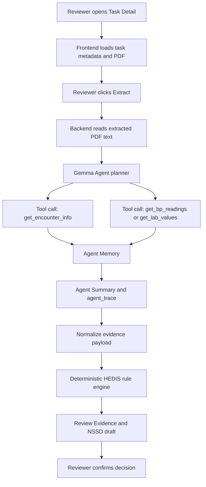

# MedComply Agent 技术报告

## 1. 项目概述

MedComply Agent 是一个面向医疗合规审查场景的 AI Agent Demo。本项目以美国 HEDIS 质量指标审查为切入点，当前支持 CBP、BPD、GSD 三类指标，目标是帮助 reviewer 从 PDF 病历中快速定位临床证据、生成可审计的结构化 evidence，并辅助完成人工确认和 NSSD 表单回填。

项目的核心设计原则是：LLM 负责读取和组织病历证据，确定性的后端 rule engine 负责最终合规判断。这样的分工既能发挥 Gemma 4 在临床文本理解、工具调用和证据汇总上的能力，又避免让模型直接做不可审计的医疗合规结论。

## 2. 模型选型

本项目最终选择 Gemma 4 26B MoE instruction model 作为 Agent 的 LLM 底座。

选择 26B MoE 规格的主要原因如下：

1. PDF 病历文本需要较强的长文本理解能力  
   当前 Demo 中的病历通常为十页以内的 text-based PDF，经过后端提取为文本后，仍包含 demographics、encounter info、vitals、labs、assessment 等多段临床信息。模型需要从非结构化文本中识别日期、就诊类型、血压读数、HbA1c、provider、DOB、患者姓名等字段，并保留 source snippet 供前端定位。相比更小规格模型，26B 级别模型在这种多字段、多段落、医学缩写混杂的文本中更稳定。

2. MoE 架构适合“准确性与响应速度平衡”的业务需求  
   医疗审查业务不能只追求生成质量，也需要 reviewer 能在页面上接受响应速度。26B MoE 提供了较强的推理和抽取能力，同时相比更大的 dense model 更适合在 Demo 场景中控制延迟和成本。实际项目中，一次 extraction 可以在可接受时间内返回，并驱动前端 Agent Trace、Evidence、NSSD draft 的完整更新。

3. 适合原生 function calling / tool calling 的 Agent 场景  
   比赛赛道要求展示 Agent 的原生函数调用、多步规划和 Memory。MedComply Agent 不是简单地把整份病历交给模型并要求输出 JSON，而是让 Gemma 4 通过 tool calling 决定调用 `get_encounter_info`、`get_bp_readings`、`get_lab_values` 等工具，逐步收集证据。26B MoE 规格在工具选择、参数生成、停止时机和最终 summary 上有足够稳定性。

4. 适合医疗合规场景的“证据抽取而非最终判定”定位  
   MedComply Agent 不要求模型直接判断 Gap Closed / Gap Open。Gemma 4 负责识别和归纳证据，例如 ED encounter 下仍需要保留 BP evidence 供 audit 和 NSSD 回填；但 ED 是否应被排除由后端 HEDIS rule engine 决定。这种架构降低了模型幻觉风险，也更符合医疗合规系统对可解释性和可追溯性的要求。

## 3. 系统架构

MedComply Agent 采用前后端分离架构：

- Frontend: Next.js + Tailwind CSS
- Backend: FastAPI + SQLModel + PostgreSQL
- LLM Provider: OpenAI-compatible Chat Completions interface, currently using Gemma 4 26B MoE through OpenRouter
- Rule Engine: Python deterministic HEDIS rules
- Review UI: PDF viewer + evidence locate + Agent Trace + reviewer confirmation

整体流程如下：

## 4. Agent 设计

MedComply Agent 的 Agent 层位于 `backend/app/agent/`，主要包含：

- `schemas.py`: 定义 Gemma Agent system prompt 和 tool schemas
- `gemma_review_agent.py`: 实现多步 tool-calling loop、Memory、停止条件和 agent trace
- `tools.py`: 执行本地工具，读取病历文本并返回结构化 evidence

Agent 的核心流程是：

1. Gemma 4 接收当前 measure code 和任务目标。
2. Gemma 4 根据 tool schema 选择需要调用的工具。
3. 工具读取病历文本，返回结构化 evidence。
4. Agent 将工具结果写入 Memory。
5. 如果证据足够，Agent 停止调用工具并生成 Agent Summary。
6. 后端将工具步骤、参数、状态、memory snapshot 和 summary 写入 `agent_trace`。
7. rule engine 基于 normalized evidence 执行确定性 HEDIS 判断。

当前工具包括：

- `get_encounter_info`: 抽取 encounter type、date of service、provider、patient name、DOB
- `get_bp_readings`: 抽取 CBP / BPD 所需血压 evidence
- `get_lab_values`: 抽取 GSD 所需 HbA1c evidence

这里的关键点是：Gemma 4 不只是被动生成 JSON，而是在 Agent loop 中进行工具选择、参数填充、证据收集和停止决策。前端 Agent Trace 面板会展示这些真实步骤，便于比赛演示和技术审查。

## 5. Memory 与 Trace 设计

为了满足 AI Agent 赛道对 Memory 和 Tool Calling 逻辑的要求，MedComply Agent 在 backend agent loop 中维护轻量 Memory：

- 已识别的 encounter context
- 已收集的 BP readings 或 HbA1c readings
- NSSD draft 所需字段
- 每一步 tool call 的结果摘要

Memory 的作用不是替代数据库，而是服务于单次 Agent run：

- 避免重复工具调用
- 支持 Agent 判断证据是否已经足够
- 支持生成 Agent Summary
- 支持前端展示完整 Agent Trace

前端 Agent Trace 面板分为两种状态：

- Extract 运行中：显示当前 live step，减少界面噪音
- Extract 完成后：显示 Agent Summary，并允许展开查看完整 tool-calling chain

当前实现采用 request-scoped trace model：单次 extraction 请求完成后，后端返回权威的 `agent_trace`，前端再展示完整链路。运行中的 live step 是面向 reviewer 的轻量进度提示，完成态展示的才是真实 tool-calling 记录。这个设计适合单份病历审查这种短任务场景，可以避免为了实时事件流额外拆分 LLM 调用或引入复杂连接状态，同时保留完整的审计证据。

因此，MedComply Agent 并不是缺少 Agent 可视化，而是有意将 Trace 设计为“请求内执行、结果中留痕、前端可展开审计”的模式。对于未来的批量 chart review、长时间 ingestion 或后台队列任务，可以在不改变 `agent_trace` payload contract 的前提下增加 backend event streaming。

## 6. PDF 病历业务适配

MedComply Agent 面向的是 PDF 病历审查，而不是普通聊天问答。PDF 病历有几个明显特点：

1. 结构半固定但字段分散  
   同一份病历中，患者信息、encounter、vitals、labs 和 assessment 分布在不同段落。Gemma 4 26B MoE 用于从这些段落中抽取业务字段，并保持 source snippet。

2. 需要证据定位  
   reviewer 不能只看到模型结论，还需要知道证据来自 PDF 哪一行。系统会保留 reading、encounter type、DOS 等 source text，前端 Locate 按钮可以在 PDF viewer 中定位和高亮。

3. 无效证据也有业务价值  
   例如 ED encounter 对 CBP/BPD 合规判断是 excluded，但 ED 文件中的 BP、DOS、provider 仍然需要保留，用于审计和 NSSD draft 回填。因此 Agent 层不能因为 encounter excluded 就提前丢弃 evidence。

4. 临床合规判断必须可审计  
   Gemma 4 负责 extraction 和 evidence collection，最终 HEDIS threshold、encounter exclusion、same-day BP consolidation 等规则由 Python rule engine 执行。这样可以明确解释每个 Gap Closed / Gap Open 的来源。

## 7. 后端规则引擎设计

MedComply Agent 将 LLM 和规则引擎分离：

- LLM / Agent: 读取病历、调用工具、抽取 evidence、生成 trace
- Rule Engine: 执行 HEDIS 判断
- Reviewer: 最终人工确认并保存 reviewer conclusion

CBP / BPD 的规则重点：

- 只接受 Office Visit、Telehealth、Remote Monitoring 等有效 encounter
- ED、Inpatient、Unknown 不进入合规判断
- 同一天多个 BP 读数时，取最低 systolic 和最低 diastolic
- BP 合规阈值为 systolic < 140 且 diastolic < 90

GSD 的规则重点：

- 只接受 HbA1c / A1C evidence
- glucose 不作为 HbA1c 替代
- 最近一次有效 HbA1c 控制判断
- HbA1c < 8.0% 视为 compliant

这种设计保证了模型能力被用于最适合的环节，而合规结论保持稳定、可测试、可解释。

## 8. 人机协同流程

MedComply Agent 不是 fully automated denial/approval system，而是 Human-in-the-Loop reviewer workflow：

1. 系统提取 PDF 病历证据。
2. 后端生成 deterministic suggestion。
3. 前端展示 evidence、rule reason、NSSD draft 和 Agent Trace。
4. reviewer 对系统建议进行确认或修改。
5. reviewer conclusion 被写回 evaluation payload。
6. 同一患者的历史 reviewer conclusion 可用于跨 measure 对照。

这个流程更贴近真实医疗合规审查：AI 提升效率，人类保留最终责任。

## 9. 对比赛要求的满足情况

| 比赛关注点 | MedComply Agent 的实现 |
|---|---|
| 使用 Gemma 4 | 使用 Gemma 4 26B MoE instruction model 作为 Agent LLM 底座 |
| 原生函数调用 | 使用 OpenAI-compatible tools/function calling schema，Gemma 调用 `get_encounter_info`、`get_bp_readings`、`get_lab_values` |
| 多步规划 | Agent loop 支持最多多轮 planner step，Gemma 可按 measure 决定工具顺序 |
| Memory | 单次 Agent run 中维护 encounter、BP/A1c、NSSD evidence memory |
| Tool Calling 逻辑清晰 | backend 保存每个 tool step 的 action、arguments、status、summary、evidence ids |
| 运行日志 / 截图 | `deliverables/gemma-agent-run.log` 和 `deliverables/gemma-agent-run.png` 可作为提交材料 |
| 非简单 Prompt 工程 | 模型不是一次性长 prompt 输出最终结论，而是通过 tool calling 收集证据，再交给 rule engine 判断 |
| 业务落地性 | 面向 HEDIS chart review，支持 PDF evidence locate、NSSD draft、reviewer confirmation |

## 10. 技术亮点

1. Agent 与规则引擎分权  
   Gemma 4 负责临床文本理解和证据收集，Python rule engine 负责最终合规判断，兼顾 AI 能力和医疗合规可审计性。

2. 面向 reviewer 的 Agent Trace  
   Trace 不只是开发日志，而是展示 Agent 如何收集 evidence 的业务解释层。评委可以看到 Gemma 的 tool calling、Memory 和 summary。

3. PDF evidence locate  
   系统保留 source snippet，并在前端 PDF viewer 中定位 evidence，减少 reviewer 在 PDF 中手动查找的时间。

4. Excluded encounter evidence retention  
   即使 encounter 是 ED/Inpatient，Agent 仍保留 BP evidence 和 NSSD fields。这体现了医疗审查中“合规排除”和“证据审计”不是同一件事。

5. 可扩展 measure architecture  
   当前支持 CBP、BPD、GSD。后续新增 measure 时，可以复用 provider、agent trace、review UI、confirm workflow，只需新增 tool extraction contract 和 rule module。

## 11. 当前边界与后续优化

当前 Demo 的边界：

- Agent Trace 采用 request-scoped trace model：单次 extraction 完成后展示后端真实 tool-calling chain；SSE/event streaming 更适合未来 batch review 或 long-running workflow，不是当前单病例 reviewer flow 的必要复杂度。
- 当前规则覆盖 Demo 所需的核心 HEDIS 场景，不声明完整替代生产级 HEDIS engine。
- Mock login 仅用于演示，不是生产认证。

后续可优化方向：

- 面向批量审查或长任务队列增加 backend event streaming，让前端实时订阅执行事件，同时复用现有 `agent_trace` 作为完成后的权威审计记录。
- 增加更多 measure-specific tools。
- 加入批量 chart review 和 reviewer queue。
- 增加更完整的 audit export。

## 12. 总结

MedComply Agent 使用 Gemma 4 26B MoE 构建了一个面向 PDF 病历合规审查的 Agent workflow。它通过原生 function calling、多步工具调用、轻量 Memory 和 Agent Trace 展示 Gemma 在医疗文本 evidence collection 中的能力，同时将最终 HEDIS 合规判断交给 deterministic backend rule engine。

这套架构避免了“长 prompt 直接给结论”的不可控风险，也比单纯的 JSON extraction 更符合 AI Agent 赛道要求。对于 PDF 病历业务，26B MoE 在临床文本理解、工具调用稳定性、响应速度和部署成本之间提供了较好的平衡，是当前 Demo 阶段合理的模型选择。
