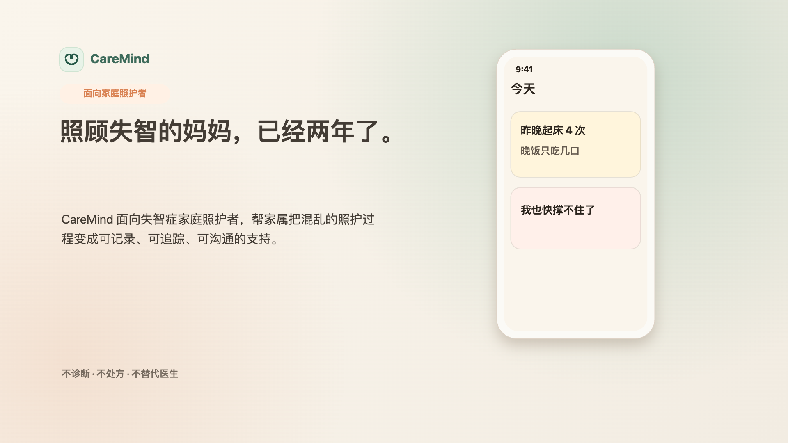

# CareMind

**赛道 C: Edge AI / Android on-device dementia-care assistant**

CareMind 是一款面向失智症家庭照护者的 AI Care Agent。它帮助家属把混乱、零散、情绪化的照护记录，整理成可追踪的照护线索、今晚可执行的小行动、低冲突沟通话术，以及复诊时可以复制给医生的摘要。

CareMind 不诊断、不处方、不判断是否需要检查，也不替代医生。C 赛道提交重点展示：**敏感照护记录可在 Android 真机上优先通过本地 Gemma LiteRT 模型处理**，让隐私数据更靠近家属自己的设备。

## Demo

- Public demo video: [Bilibili BV1hFEg6ZEVb](https://www.bilibili.com/video/BV1hFEg6ZEVb)
- Main project repository: [hyczy0809/CareMind](https://github.com/hyczy0809/CareMind)
- Demo backend: [https://caremind-1039168666325.us-west1.run.app](https://caremind-1039168666325.us-west1.run.app)
- Android release APK: produced from `frontend/android` with backend URL above.



## Edge AI Story

```text
Sensitive care note on Android phone
-> user turns on Privacy Mode
-> app loads a downloadable Gemma LiteRT model
-> local care-note understanding / suggestion generation
-> cloud agent is optional for non-private or fuller workflows
```

The submitted source includes the Android native bridge, model downloader, model lifecycle holder, local inference router, XML prompt/parser path, and Cloud Run model catalog API.

## Model Choice

CareMind's on-device path supports `.litertlm` / `.task` Gemma-family model artifacts through the same Android LiteRT integration.

| Model | Role | Notes |
|---|---|---|
| Gemma 4 E2B / E4B LiteRT | larger candidate model | Supported by the dynamic model catalog and Android download/load path where device memory allows. |
| Gemma 3 1B LiteRT | hardware-demo fallback | Used for the current mid-range Android demo because it is about 557 MB and avoids OOM crashes on ordinary phones. |

The model list is not hard-coded in the APK. The app calls:

```http
GET /api/models
```

The Cloud Run backend scans Google Cloud Storage and returns every `.litertlm` or `.task` file under the configured prefix. Adding a Gemma 4 E2B/E4B file to the bucket updates the app's model picker without rebuilding the APK.

## Gemma Feature Alignment

The official technical checklist mentions Native Function Calling, multimodal processing, and Edge AI deployment as key ways to demonstrate Gemma usage. CareMind's primary technical contribution for this submission is **Edge AI deployment on Android**.

What is implemented:

- Android native module for Gemma-family LiteRT model lifecycle: download, readiness check, engine init, release, text generation, and audio-aware generation hook.
- Dynamic model catalog through Cloud Run and Google Cloud Storage, so Gemma 4 E2B/E4B LiteRT candidates can be added without rebuilding the APK.
- Privacy-mode inference router that decides whether a sensitive note should stay on the device or use the cloud workflow.
- Structured XML contracts and parsers for local Gemma output, plus deterministic fallbacks for incomplete model responses.
- Local guardrail, care-workflow, and follow-up-summary modules that turn model output into typed product data instead of raw chat text.

What is intentionally not claimed:

- This is not a Native Function Calling-first submission. The on-device LiteRT path uses direct local generation plus typed contracts because offline Android inference is the core C-track requirement.
- Voice input currently uses Android system speech recognition to create editable text before local LLM processing; fully local audio transcription remains a future extension.

In short, CareMind is more than prompt engineering: the model is embedded into a native Android privacy mode with model management, routing, structured parsing, safety boundaries, and a real hardware demo path.

## Hardware Demo Setup

### Hardware

- Android phone
- Android 8.0+ recommended
- At least 4 GB RAM recommended for the 1B fallback model
- More RAM required for Gemma 4 E2B/E4B LiteRT experiments

### Android Build Environment

- Expo SDK 52
- React Native 0.76
- Android compileSdk 35
- Android minSdk 24
- Kotlin / Gradle through the Expo Android project
- JDK 17 recommended
- MediaPipe GenAI runtime: `com.google.mediapipe:tasks-genai:0.10.35`

No Raspberry Pi, MCU, custom kernel module, or bottom-level driver is required. The hardware target is a standard Android phone.

### Hardware Demo Steps

1. Install the APK on an Android phone.
2. Open **Settings / Privacy Mode**.
3. Refresh the model catalog.
4. Download a LiteRT model from the backend.
5. Turn off Wi-Fi and mobile data.
6. Enter a sensitive care note:

```text
外婆夜里醒了四次，一直说有人偷钱，晚饭只吃了几口，妈妈也很累。
```

7. Show that CareMind returns local, non-diagnostic care observations and lower-burden next actions.

Suggested caption for the hardware demo:

```text
Network off. Gemma LiteRT runs on the Android device for local care-note understanding.
```

## Repository Contents

```text
CareMind/
├── README.md
├── TECHNICAL_REPORT.md
├── EDGE_HARDWARE_DEMO.md
├── requirements.txt
├── docs/
│   ├── caremind-demo-video-preview.png
│   ├── demo_storyboard.md
│   └── recording_guide.md
└── source/
    ├── backend/
    │   ├── main.py
    │   ├── requirements.txt
    │   ├── Dockerfile
    │   └── .env.example
    └── frontend/
        ├── app.json
        ├── package.json
        ├── lib/inference/
        ├── lib/speech/android-speech.ts
        └── android/
```

The full product repository is linked above. This submission folder keeps only the C-track-relevant core source so reviewers can inspect the edge path quickly.

## Quick Start

### Backend

```bash
cd source/backend
python3 -m venv .venv
source .venv/bin/activate
pip install -r requirements.txt
cp .env.example .env
uvicorn main:app --host 127.0.0.1 --port 8090
```

### Backend With Docker

The submission includes a backend `Dockerfile`. From this folder:

```bash
cd source/backend
cp .env.example .env
```

For local judging without cloud credentials, the backend can still start and expose health/model metadata endpoints. Build and run:

```bash
docker build -t caremind-backend .
docker run --rm \
  --env-file .env \
  -e PORT=8080 \
  -p 8080:8080 \
  caremind-backend
```

Smoke test:

```bash
curl http://127.0.0.1:8080/health
curl http://127.0.0.1:8080/api/models
```

For the full hosted model-catalog flow, configure these environment variables in `.env` before running the container:

```env
CAREMIND_GCS_MODEL_BUCKET=caremind-498713-models-asia
CAREMIND_GCS_MODEL_PREFIX=models
CAREMIND_GCS_DYNAMIC_CATALOG=1
CAREMIND_GCS_MODEL_DELIVERY=redirect
```

The production demo backend is deployed on Cloud Run:

```text
https://caremind-1039168666325.us-west1.run.app
```

Useful endpoints:

```http
GET  /health
GET  /api/models
GET  /api/models/{filename}/meta
GET  /api/models/{filename}
POST /api/care-workflow
POST /api/reports/follow-up
```

### Android

The full Android project is available in the main repository. The submitted files show the key native and TypeScript edge modules.

```bash
cd frontend
npm install
npm run typecheck
cd android
NODE_ENV=production \
EXPO_PUBLIC_CAREMIND_API_URL=https://caremind-1039168666325.us-west1.run.app \
./gradlew :app:assembleRelease
```

## Privacy And Safety

CareMind handles dementia-care data, which may include family conflict, caregiver distress, medication observations, and clinic materials. The app therefore follows these boundaries:

- Sensitive care notes can be routed to the on-device model in Privacy Mode.
- Cloud mode is optional and intended for fuller agent workflows and long-term summaries.
- Reviewed medical documents enter the follow-up summary only after caregiver confirmation.
- The app does not output diagnosis, prescription, medication adjustment, or imaging/test decisions.
- Crisis or emergency cases should be handled by local emergency services or clinicians.

## Why Track C

The core insight of CareMind is not only "AI can summarize notes." It is that **the most sensitive care moments often happen at home, late at night, on the caregiver's phone**. Edge AI is therefore a product requirement: the assistant should be able to structure and respond to private care notes without requiring every raw detail to leave the device.
