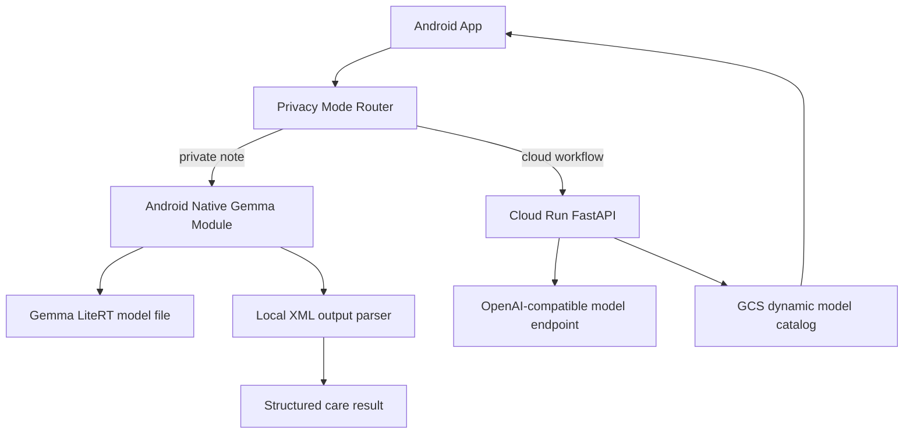

# CareMind Technical Report

## 1. Problem

Families caring for a person with dementia often need to remember scattered daily details: night waking, refusal to eat or take medication, delusion-like expressions, door-opening attempts, caregiver exhaustion, and doctor-visit questions. These details matter clinically, but most of them happen outside the hospital and are recorded under stress.

CareMind turns those moments into a structured care workflow while staying inside a non-diagnostic boundary.

## 2. Edge AI Architecture



The app contains two inference paths:

1. **Local path**: Android native module loads a downloaded `.litertlm` / `.task` file and runs on-device text understanding.
2. **Cloud path**: FastAPI backend orchestrates the richer care workflow and model catalog.

## 3. Core Components

### Android Native Layer

Relevant files:

```text
source/frontend/android/app/src/main/java/com/caremind/app/gemma/
source/frontend/android/app/src/main/java/com/caremind/app/speech/
```

Responsibilities:

- Download model files into app-private storage.
- Resume/cancel large model downloads.
- Expose model readiness and generation APIs to React Native.
- Keep the loaded Gemma engine as a singleton to avoid repeated model initialization.
- Use Android system speech recognition for voice-to-editable-text before the local LLM step.

### TypeScript Local Inference Layer

Relevant files:

```text
source/frontend/lib/inference/local/
source/frontend/lib/inference/inference-router.ts
source/frontend/lib/inference/privacy-mode.ts
```

Responsibilities:

- Route between privacy mode and cloud mode.
- Generate local prompts for care workflow, guardrails, and follow-up summaries.
- Parse XML-tag output from smaller local models.
- Fall back to deterministic builders when model output is incomplete.
- Record local telemetry without storing sensitive raw notes unnecessarily.

### Backend Model Catalog

Relevant files:

```text
source/backend/main.py
```

Responsibilities:

- Serve `GET /api/models`.
- Scan Google Cloud Storage for `.litertlm` / `.task` model files.
- Keep a stable `/api/models/{filename}` URL for the APK.
- Redirect large downloads to Cloud Storage to avoid Cloud Run response-size limits.
- Keep cloud workflow APIs available for non-private mode.

## 4. Gemma / LiteRT Integration

The Android integration is designed for Gemma-family LiteRT model artifacts. The model file is not bundled into the APK because:

- 500 MB+ artifacts make APK distribution fragile.
- Different phones have different RAM ceilings.
- The team needs to add/remove candidate models without forcing teammates to reinstall the app.

The app therefore fetches model metadata dynamically from Cloud Run. The backend can expose Gemma 4 E2B/E4B LiteRT candidates when available, and can also expose a smaller 1B fallback for live demos on ordinary hardware.

## 5. Gemma Feature Alignment

CareMind is submitted to **Track C: Edge AI**, so the primary Gemma feature demonstrated is **on-device / edge deployment** rather than Native Function Calling.

The implementation goes beyond a single prompt:

- The Android native module exposes model lifecycle operations to React Native: `downloadModel`, `isModelReady`, `initEngine`, `releaseEngine`, `generate`, and `generateWithAudio`.
- The backend exposes a dynamic model catalog (`GET /api/models`) backed by Cloud Storage, allowing Gemma 4 LiteRT files to appear in the Android model picker without rebuilding the app.
- The frontend inference router switches between local privacy mode and cloud mode.
- Local Gemma output is constrained by typed XML contracts, parsed into product objects, and repaired by deterministic fallbacks when the model response is incomplete.
- The same product modules run locally: care-note structuring, guardrail checking, communication script generation, and follow-up-summary drafting.
- The cloud ADK route demonstrates Native Function Calling / Tool Calling: `cloud_agents.py` registers care and memory tools, while `cloudflare_openai_model.py` serializes those tool declarations into OpenAI-compatible `tools` with `tool_choice: auto`, then maps returned `tool_calls` back into ADK function calls.

Native Function Calling is not the offline LiteRT mechanism. For Android privacy mode, CareMind uses direct LiteRT generation plus typed output contracts because this is the most reliable way to keep sensitive care notes on the device. For the optional cloud Agent workflow, the model is given explicit care tools and can choose tool calls through the OpenAI-compatible adapter.

### Cloud Agent Tool Set

Representative tools exposed to the cloud root agent:

```text
run_cloud_care_workflow
extract_care_signals
log_extracted_events
assess_patient_risk
assess_caregiver_burden
create_care_plan
get_communication_script
retrieve_patient_profile
retrieve_recent_events
retrieve_behavior_baseline
retrieve_medication_memory
retrieve_caregiver_state
retrieve_professional_knowledge
generate_doctor_summary
```

This lets the model orchestrate a sequence such as:

```text
user note
-> call run_cloud_care_workflow
-> retrieve / update memory
-> generate risk and caregiver support cards
-> prepare doctor-facing summary
-> return a non-diagnostic final answer
```

## 6. Output Format

Small local models are more reliable with XML-like tagged output than strict JSON. CareMind uses XML prompts for the on-device path and normalizes results into the same data shape used by cloud mode.

Example local output shape:

```xml
<summary>今晚出现夜间醒来、少食和照护者疲惫信号。</summary>
<risk level="medium">夜间活动增加，建议关注跌倒和开门风险。</risk>
<action>今晚先确认门锁和走廊夜灯。</action>
<boundary>这不是诊断或用药建议。</boundary>
```

## 7. Safety Boundaries

CareMind intentionally avoids:

- diagnosing dementia progression;
- changing medication;
- deciding whether MRI / CT / lab tests are needed;
- interpreting reports as a clinical conclusion;
- replacing emergency help.

The safety strategy combines:

- product copy;
- prompt boundaries;
- local and cloud guardrail modules;
- caregiver confirmation before follow-up summaries include medical-adjacent document notes.

## 8. Data Compliance

For Track C / Social-impact-adjacent usage, CareMind treats care data as sensitive family data.

- Demo data is synthetic.
- No real patient data is required for evaluation.
- Model files are distributed through Cloud Storage rather than committed into regular Git history.
- The app can process private care notes locally in Privacy Mode.
- Cloud summaries are generated only when the caregiver intentionally uses cloud mode or reviewed follow-up preparation.

## 9. Docker Deployment

The submitted backend can be run with Docker:

```bash
cd source/backend
cp .env.example .env
docker build -t caremind-backend .
docker run --rm --env-file .env -e PORT=8080 -p 8080:8080 caremind-backend
```

Smoke test:

```bash
curl http://127.0.0.1:8080/health
curl http://127.0.0.1:8080/api/models
```

For the hosted model-catalog path, set:

```env
CAREMIND_GCS_MODEL_BUCKET=caremind-498713-models-asia
CAREMIND_GCS_MODEL_PREFIX=models
CAREMIND_GCS_DYNAMIC_CATALOG=1
CAREMIND_GCS_MODEL_DELIVERY=redirect
```

## 10. Verification

Local verification used during development:

```bash
python3 -m py_compile main.py
cd frontend
npm run typecheck
cd android
./gradlew :app:compileReleaseKotlin
```

Release APK build command:

```bash
cd frontend/android
NODE_ENV=production \
EXPO_PUBLIC_CAREMIND_API_URL=https://caremind-1039168666325.us-west1.run.app \
./gradlew :app:assembleRelease
```

## 11. Known Limitations

- On-device Gemma 4 E2B/E4B may exceed memory on mid-range phones. The runtime path supports those files, but live judging should use hardware appropriate to the model size.
- The current voice input path uses Android system speech recognition before local LLM processing. Fully local audio transcription is out of scope for this submission.
- The local model path focuses on care-note understanding and suggestion generation; cloud mode remains better for long-range summaries and richer agent workflows.
